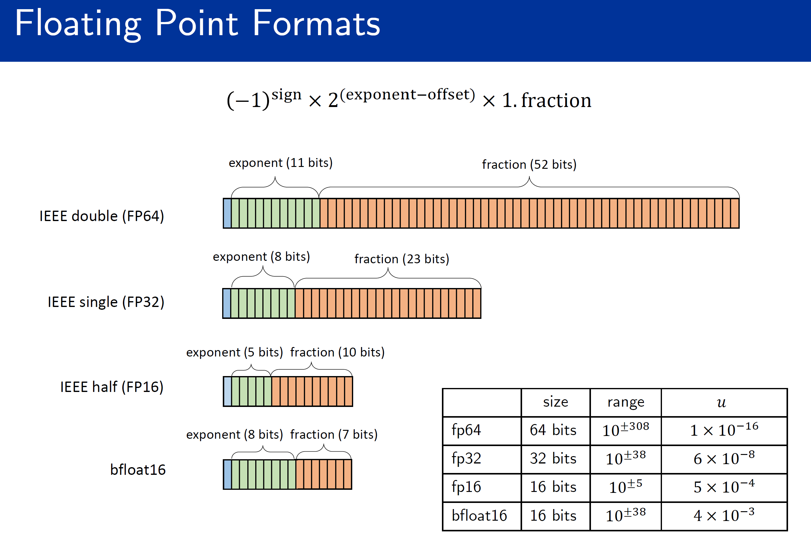

Floating point simuluation
=====================================================

A floating point number systems can be represented by

.. math::

    y = \pm m \times \beta^{e-t}

``pychop`` built-in method ``chop`` supports the following precision:

.. csv-table:: Supported floating point precisions
   :header: "Format", "Description"
   :widths: 15, 15

    "'q43' and 'fp8-e4m3'",  "NVIDIA quarter precision (4 exponent bits, 3 significand (mantissa) bits)"
    "'q52' and 'fp8-e5m2'",	"NVIDIA quarter precision (5 exponent bits, 2 significand bits)"
    "'b' and 'bfloat16'", "bfloat16"
    "'h' and 'half' and 'fp16'", "IEEE half precision (the default)"
    "'s' and 'single' and 'fp32'", "IEEE single precision"
    "'d' and 'double' and 'fp64'", "IEEE double precision"
    "'c' and 'custom'", "custom format"

Besides, the supported rounding modes include (user can specify it by setting the parameter ``rmode`` in terms of the number):

1. Round to nearest using round to even last bit to break ties (the default).

2. Round towards plus infinity (round up).

3. Round towards minus infinity (round down).

4. Round towards zero.

5. Stochastic rounding - round to the next larger or next smaller floating-point number with probability proportional to the distance to those floating-point numbers.

6. Stochastic rounding - round to the next larger or next smaller  floating-point number with equal probability.

Subnormal numbers is supported, they are flushed to zero if it not considered (by setting ``subnormal`` to 0).

``pychop`` also supports customized precisions One can also use customized floating point arithmetic by defining precision:

.. code:: python

    from pychop import customs
    prec = customs(t=2, emax=10) # use precision 2 and set maximum exponenet of 10

Second, define parameter ``customs`` instead of ``prec``, 

.. code:: python

    from pychop import chop
    x = np.random.rand(10000, 10000) # use x = torch.rand(size=(10000, 10000)) for Torch backend
    nc = chop(customs=prec, rmode=3) 
    y = nc(x)
    print(y[0, :5])

To print out the unit-roundoff information, simply set ``verbose=1``, use

.. code:: python
    
    pyq_f = chop('h', verbose=1)

The result is:

.. code:: bash

    The floating point format is with unit-roundoff of 4.882812e-04 (≈2^-11).
    

The above example is for bit-level simulation for a small number of values, which is not a high performance implementaion, but rather a tool for illustration.

One can depoy a direct setting to floating point arithmetic:

.. code:: python

    from pychop import simulate
    import numpy as np
    x = np.random.rand(100, 100)
    si = simulate(base=2, t=11, emax=22, sign=False, subnormal=False, rmode=1)
    y = si.rounding(x)
    print(y[0, :5])

Note that if emin is not set, then IEEE 754 assumption is used which means emin = 1 - emax
