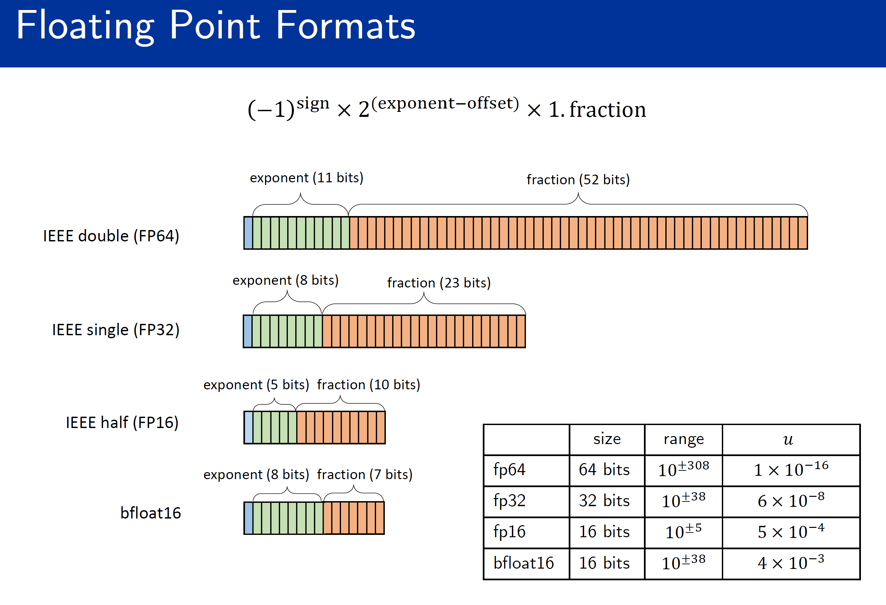

.. _float_precision_simulator:

Floating-point quantizers
=========================

``Chop`` is the fast backend-dispatched interface for IEEE-like custom exponent
and trailing-fraction widths. ``FaultChop`` exposes the older research interface,
named precisions and fault injection. ``Simulate`` is an educational arbitrary
radix interface for small problems. P3109 has distinct semantics; use :doc:`p3109`.

   Common floating-point layouts. Fraction widths exclude the implicit leading
   bit; the table gives approximate magnitudes and unit roundoff.

Chop parameters and rounding
----------------------------

.. code-block:: python

   import numpy as np
   from pychop import Chop

   q = Chop(exp_bits=5, sig_bits=10, rmode=1, subnormal=True, random_state=42)
   x = np.array([.1, -.3, 1.1])
   print(q(x))

``exp_bits`` counts exponent bits; ``sig_bits`` counts trailing fraction bits.
``subnormal=False`` requests flushing of subnormal values. ``chunk_size`` controls
NumPy/Dask chunking where applicable. The default ``random_state`` is 42.
The public call is ``q(x)``; do not pass a rounding mode to the call or use
``q.quantize(x, rmode=...)``. Construct a quantizer with the desired policy.

.. list-table:: Integer rmode values
   :header-rows: 1

   * - rmode
     - Rounding rule
   * - 1
     - Nearest, ties to even
   * - 2
     - Toward positive infinity (for either input sign)
   * - 3
     - Toward negative infinity (for either input sign)
   * - 4
     - Toward zero
   * - 5
     - Stochastic, proportional to fractional distance
   * - 6
     - Stochastic, equal probability
   * - 7
     - Nearest, ties to zero
   * - 8
     - Nearest, ties away from zero
   * - 9
     - Round to odd
   * - 10
     - CADNA-style random directed rounding

Use integer modes with ``Chop``. Preserve the quantizer instance across stochastic
calls; recreate it with the same seed to reproduce a sequence. Different backends
can use different random generators. Do not assume a seed yields matching bits
on NumPy, Torch, JAX and TensorFlow.

Framework examples
------------------

Install the corresponding optional extra first. Auto dispatch recognizes inputs.
TensorFlow quantization uses TensorFlow operations; STE-enabled wrappers are
provided for training through nondifferentiable rounding.

.. code-block:: python

   import torch
   from pychop import Chop

   q = Chop(5, 10, rmode=1)
   print(q(torch.tensor([.1, -.3, 1.1])))

.. code-block:: python

   import jax.numpy as jnp
   from pychop import Chop

   q = Chop(5, 10, rmode=1)
   print(q(jnp.array([.1, -.3, 1.1])))

.. code-block:: python

   import tensorflow as tf
   from pychop import Chop

   q = Chop(5, 10, rmode=1)
   print(q(tf.constant([.1, -.3, 1.1])))

Research interfaces
-------------------

.. code-block:: python

   import numpy as np
   from pychop import Customs, FaultChop

   parameters = Customs(t=8, emax=15)
   q = FaultChop(customs=parameters, rmode=3)
   print(q(np.array([.1, -.3, 1.1])))

``Customs`` and ``Simulate`` are capitalized public names. ``FaultChop`` also
accepts named formats such as ``prec="h"``. Its ``flip`` and ``p`` parameters
control simulated significand bit faults. These faults are separate from
subnormal-number support. Keep fault experiments separate from baseline
rounding-error measurements.

.. code-block:: python

   import numpy as np
   from pychop import Simulate

   model = Simulate(base=2, t=4, emax=4, sign=True, subnormal=True, rmode=1)
   print(model.rounding(np.array([.1, -.3, 1.1])))
