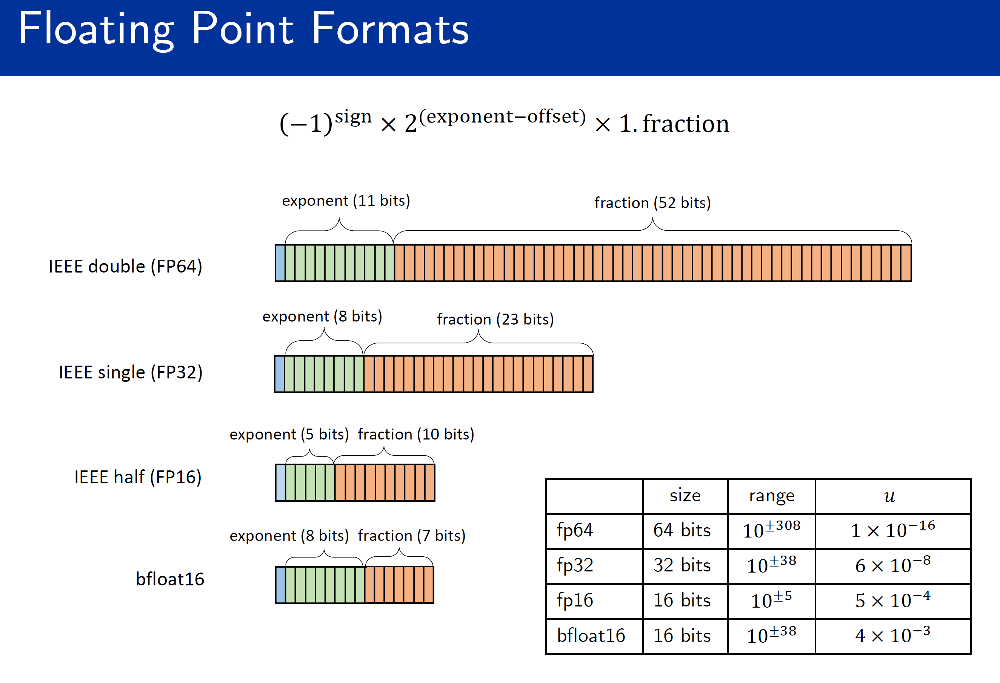

.. _float_precision_simulator:

Float precision simulator classes
=================================

A floating point number systems can be represented by

.. math::

    y = \pm m \times \beta^{e-t}

Chop: soft error simulator for floating point arithmetic
=================================================================

``pychop`` built-in method ``chop`` supports the following precision:

.. csv-table:: Supported floating point precisions
   :header: "Format", "Description"
   :widths: 15, 15

    "'q43' and 'fp8-e4m3'",  "NVIDIA quarter precision (4 exponent bits, 3 significand (mantissa) bits)"
    "'q52' and 'fp8-e5m2'",	"NVIDIA quarter precision (5 exponent bits, 2 significand bits)"
    "'b' and 'bfloat16'", "bfloat16"
    "'h' and 'half' and 'fp16'", "IEEE half precision (the default)"
    "'s' and 'single' and 'fp32'", "IEEE single precision"
    "'d' and 'double' and 'fp64'", "IEEE double precision"
    "'c' and 'custom'", "custom format"

Besides, the supported rounding modes include (user can specify it by setting the parameter ``rmode`` in terms of the number):

1. Round to nearest using round to even last bit to break ties (the default).

2. Round towards plus infinity (round up).

3. Round towards minus infinity (round down).

4. Round towards zero.

5. Stochastic rounding - round to the next larger or next smaller floating-point number with probability proportional to the distance to those floating-point numbers.

6. Stochastic rounding - round to the next larger or next smaller  floating-point number with equal probability.

Subnormal numbers is supported, they are flushed to zero if it not considered (by setting ``subnormal`` to 0).

``pychop`` also supports customized precisions One can also use customized floating point arithmetic by defining precision:

.. code:: python

    from pychop import customs
    prec = customs(t=2, emax=10) # use precision 2 and set maximum exponenet of 10

Second, define parameter ``customs`` instead of ``prec``, 

.. code:: python

    from pychop import chop
    x = np.random.rand(10000, 10000) # use x = torch.rand(size=(10000, 10000)) for Torch backend
    nc = chop(customs=prec, rmode=3) 
    y = nc(x)
    print(y[0, :5])

To print out the unit-roundoff information, simply set ``verbose=1``, use

.. code:: python
    
    pyq_f = chop('h', verbose=1)

The result is:

.. code:: bash

    The floating point format is with unit-roundoff of 4.882812e-04 (≈2^-11).
    

The above example is for bit-level simulation for a small number of values, which is not a high performance implementaion, but rather a tool for illustration.

One can depoy a direct setting to floating point arithmetic:

.. code:: python

    from pychop import simulate
    import numpy as np
    x = np.random.rand(100, 100)
    si = simulate(base=2, t=11, emax=22, sign=False, subnormal=False, rmode=1)
    y = si.rounding(x)
    print(y[0, :5])

Note that if emin is not set, then IEEE 754 assumption is used which means emin = 1 - emax

LightChop: fast transparent precision emulation for floating point arithmetic
=========================================================================================
The `LightChop` class enables quantization of floating-point numbers into a custom floating-point format similar to IEEE 754, defined by a specified number of exponent and mantissa bits. This document outlines the usage and examples of this class across three frameworks: PyTorch, NumPy, and JAX. Each implementation supports six rounding modes: 

.. code-block:: 

    - 0 or "nearest_odd": Round to nearest value, ties to odd.
    - 1 or "nearest": Round to nearest value, ties to even (IEEE 754 default).
    - 2 or "plus_inf": Round towards plus infinity (round up).
    - 3 or "minus_inf": Round towards minus infinity (round down).
    - 4 or "toward_zero": Truncate toward zero (no rounding up).
    - 5 or "stoc_prop": Stochastic rounding proportional to the fractional part.
    - 6 or "stoc_equal": Stochastic rounding with 50% probability.

This guide offers a practical introduction to the `LightChop` classes, with code examples formatted for clarity and illustrative outputs reflecting the FP16-like behavior

Overview

--------LightChop

The `LightChop` converts floating-point values into a custom floating-point representation with:
- **Exponent Bits**: Determines the range of representable values.
- **Mantissa Bits**: Determines the precision of the fractional part.
- **Format**: For FP16-like settings (5 exponent bits, 10 mantissa bits), the range is approximately \([-65504, 65504]\) with a precision of about \(2^{-10} = 0.0009765625\) for normal numbers.

The quantization process decomposes the input into sign, exponent, and mantissa components, applies the selected rounding mode to the mantissa, and reconstructs the value, handling special cases like zeros, infinities, and NaNs.

Usage
-----

Common parameters
~~~~~~~~~~~~~~~~~

- **exp_bits**: Number of bits for the exponent, defining the dynamic range.
- **sig_bits**: Number of bits for the mantissa, defining the precision.
- **rmode**: String specifying the rounding method, defaulting to "nearest".

PyTorch version
~~~~~~~~~~~~~~~

The PyTorch implementation operates on PyTorch tensors, aligning with IEEE 754 conventions and integrating seamlessly into PyTorch workflows.

**Initialization**

Create an instance by specifying the number of exponent and mantissa bits, such as 5 and 10 for an FP16-like format.

**Quantization**

Quantize a tensor by calling the quantization method with the input tensor and an optional rounding mode. The result is a tensor quantized to the custom floating-point format.

**Code example**:

.. code-block:: python

    # Initialize with 5 exponent bits and 10 mantissa bits (FP16-like)
    sim = LightChop(exp_bits=5, sig_bits=10)
    # Input tensor
    values = torch.tensor([1.7641, 0.3097, -0.2021, 2.4700, 0.3300])
    # Quantize with nearest rounding
    result = sim.quantize(values, rmode="nearest")
    print(result)

NumPy Version
~~~~~~~~~~~~~

The NumPy version works with NumPy arrays, providing a general-purpose floating-point quantization tool.

**Initialization**

Instantiate the simulator with the desired exponent and mantissa bit counts.

**Quantization**

Apply the quantization method to a NumPy array, optionally specifying a rounding mode, to produce a quantized array.

**Code Example**:

.. code-block:: python

    # Initialize with 5 exponent bits and 10 mantissa bits, half precision
    ch = LightChop(exp_bits=5, sig_bits=10, rmode="nearest")
    # Input array
    values = np.array([1.7641, 0.3097, -0.2021, 2.4700, 0.3300])
    # Quantize with nearest rounding
    result = ch(values)
    print(result)

JAX version
~~~~~~~~~~~

The JAX version utilizes JAX arrays and includes JIT compilation for performance, requiring a PRNG key for stochastic rounding modes.

**Initialization**

Set up the simulator by defining the exponent and mantissa bits.

**Quantization**

Quantize a JAX array using the quantization method, providing the array, an optional rounding mode, and a PRNG key for stochastic modes. The output is a quantized JAX array.

**Code Example**:

.. code-block:: python

    # Initialize with 5 exponent bits and 10 mantissa bits, half precision
    ch = LightChop(exp_bits=5, sig_bits=10, rmode="nearest")
    # Input array
    values = jnp.array([1.7641, 0.3097, -0.2021, 2.4700, 0.3300])
    # PRNG key for stochastic modes
    key = random.PRNGKey(42)
    # Quantize with nearest rounding (no key needed)
    result = ch(values)
    print(result)

Examples
--------

The examples below demonstrate the quantization of the input values `[1.7641, 0.3097, -0.2021, 2.47, 0.33]` using a custom FP16-like format (5 exponent bits, 10 mantissa bits) across all rounding modes. Outputs are based on the PyTorch implementation and should be consistent across frameworks, with stochastic modes varying unless seeded (JAX uses PRNG key 42).

**Input Values**

.. code-block:: text

    [1.7641, 0.3097, -0.2021, 2.47, 0.33]

**Outputs by Rounding Mode**

- **Nearest**:

  .. code-block:: text

      [1.7637, 0.3098, -0.2020, 2.4707, 0.3301]

  Rounds the mantissa to the nearest representable value.

- **Up**:

  .. code-block:: text

      [1.7646, 0.3101, -0.2019, 2.4727, 0.3303]

  Positive values round toward positive infinity, negative values toward negative infinity.

- **Down**:

  .. code-block:: text

      [1.7637, 0.3096, -0.2021, 2.4707, 0.3298]

  Positive values round toward negative infinity, negative values toward positive infinity.

- **Towards Zero**:

  .. code-block:: text

      [1.7637, 0.3096, -0.2019, 2.4707, 0.3298]

  Truncates the mantissa toward zero, reducing magnitude.

- **Stochastic Equal**:

  .. code-block:: text

      [1.7637, 0.3098, -0.2020, 2.4707, 0.3301]  # Example with JAX PRNG key 42

  Randomly chooses between floor and ceiling with equal probability (varies across runs).

- **Stochastic Proportional**:

  .. code-block:: text

      [1.7646, 0.3098, -0.2019, 2.4707, 0.3301]  # Example with JAX PRNG key 42

  Randomly chooses between floor and ceiling, with probability proportional to the fractional part (varies across runs).

Notes
-----

- **Comparison to Native FP16**: The "nearest" mode closely matches PyTorch’s native FP16 quantization (e.g., `[1.7637, 0.3098, -0.2020, 2.4707, 0.3301]`), validating the implementation.
- **Stochastic Modes**: Outputs for `stochastic_equal` and `stochastic_proportional` depend on random number generation, with JAX requiring a PRNG key for reproducibility, unlike PyTorch and NumPy’s internal randomness.
- **Special Cases**: All versions handle zeros, infinities, and NaNs appropriately, preserving IEEE 754-like behavior.

.
