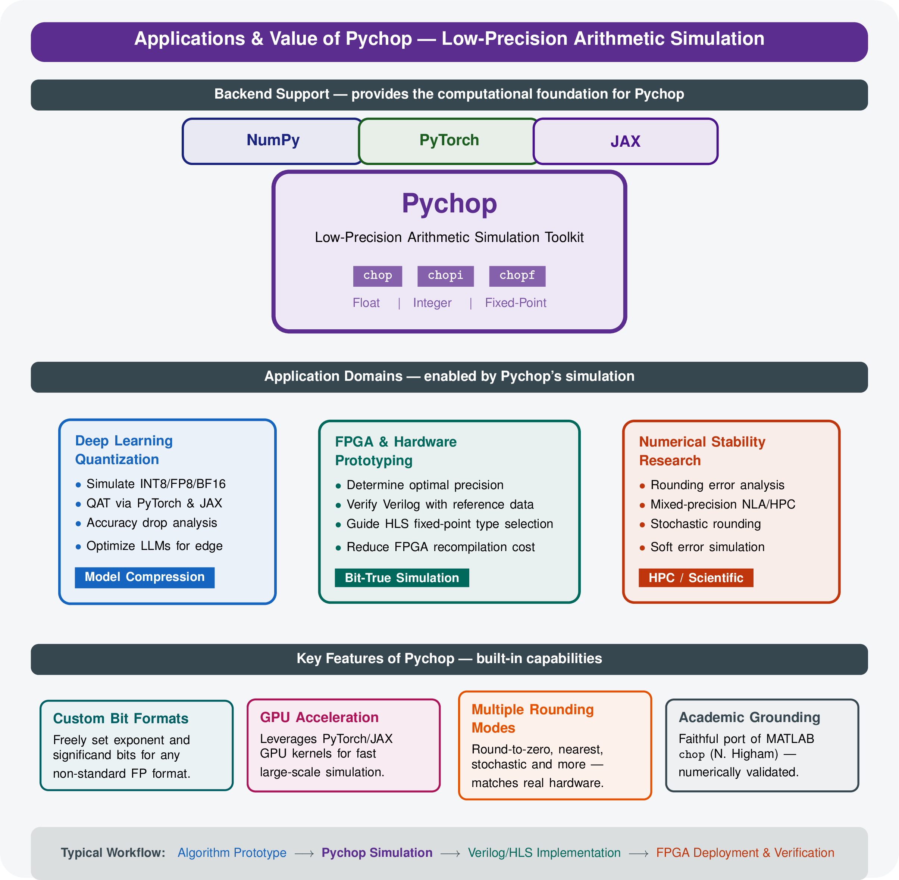

pychop: reduced-precision arithmetic
====================================

.. image:: ../imgs/pychop_logo.png
   :alt: Pychop — efficient reduced-precision emulation
   :width: 480px
   :align: center

Pychop emulates floating-point, fixed-point, integer, block floating-point (BFP),
and microscaling (MX) quantization. Use it to measure numerical error and study
algorithms before choosing a hardware format. NumPy, PyTorch, JAX and TensorFlow
backends support different application workflows; see :doc:`architecture`.

Emulation generally retains the host floating-point storage and performs host
arithmetic followed by rounding. It does not automatically make a model smaller
or accelerate its arithmetic. Explicit integer code export is available for
:doc:`p3109`; BFP/MX storage estimates describe logical formats, not necessarily
the bytes occupied by a Python object.

Start with :doc:`start`, then follow :doc:`p3109` for format selection, rounding
and parameter export. The :doc:`examples` chapter includes runnable quantized
models and native tensor training without dataset downloads.

   Application overview. The illustration shows the original NumPy, PyTorch and
   JAX workflows; TensorFlow is also supported. See :doc:`architecture` for
   backend coverage and numerical contracts.

.. toctree::
   :maxdepth: 2
   :caption: Learn and use

   start
   p3109
   examples
   architecture
   validation

.. toctree::
   :maxdepth: 2
   :caption: API and existing workflows

   float_point
   builtin
   linalg
   mathfunc
   integer
   fix_point
   bfp_formats
   ocp_mx
   layers
   ptq
   optimizers
   matlab
   license
